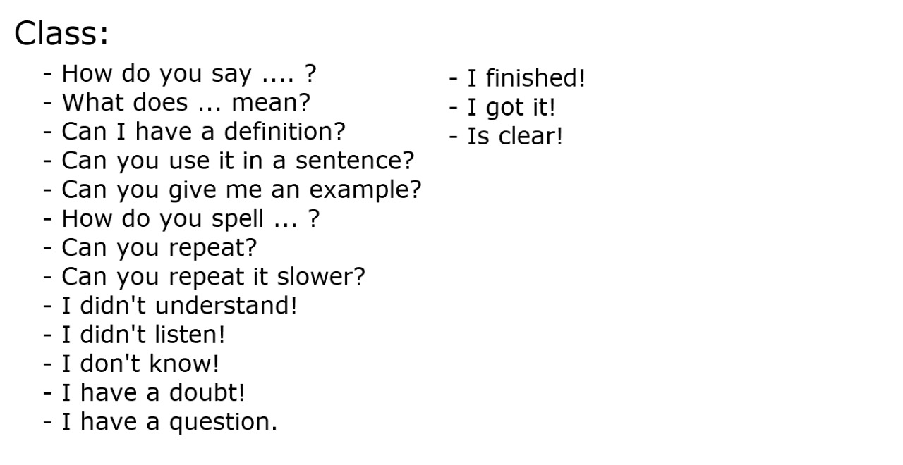
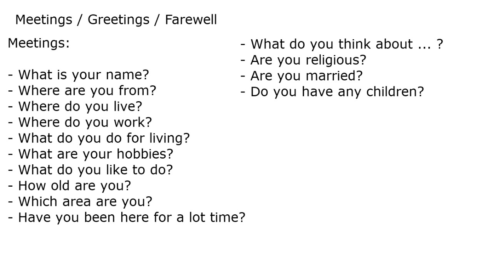
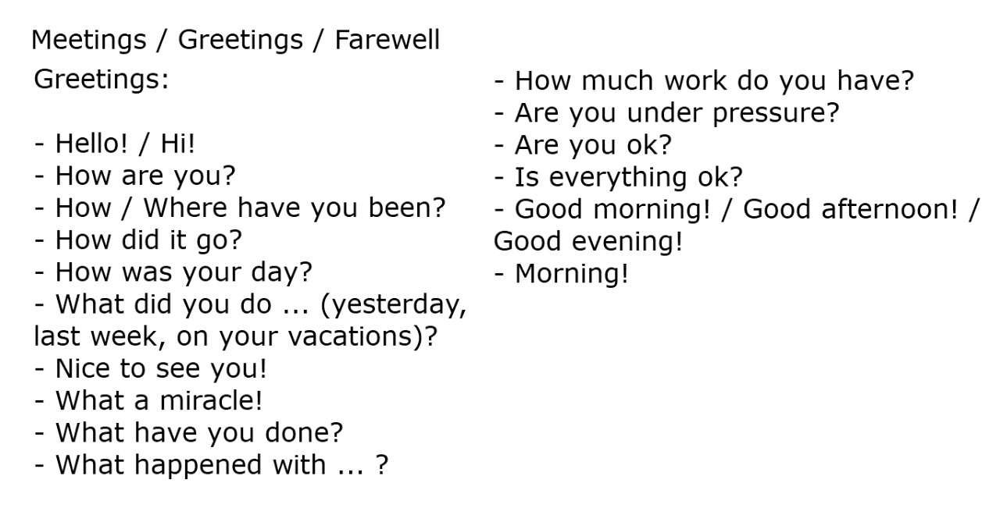

## Basic questions

### Questions for class

### Questions for meetings

### Questions for greetings

### Questions for farewell

## Homework

You write a conversation for your first day in a new job.

J: Hi! my name is Javier. What is your name?\
D: Hi! Javier. My name is Diana. Nice to meet you.\
J: Nice to meet you too\
D: Are you a new employed?\
J: Yes, I'll be in the Data Analysis area. What is the area in your job?\
D: Very well! We are to work in same area.\
J: Excelent! What is your position?\
D: I'm tech lead from Data Analysis\
J: Perfect! I'm data analyst\
J: I hope to learn very much from you\
D: Here all learn from all\
J: How much time working here?\
D: So So! I have 3 years ago\
J: This is very long time for me\
D: Where was you working before this employ?\
J: This is my 3th employe. I was working as consultant in some sites\
D: Good! Is this your firts day?\
J: Yes This is correct!\
D: Do you take the tour to the office?\
J: No I don't\
D: If you want to take it together\
J: Yes, I will like it\
D: Good! follow me.\
J: Of course. Say me for where going to\
D: This is the countable area\
D: This is the coffe break site\
D: That is the principal office\
D: Here is the restroom\
D: .\
D: .\
D: .\
D: .\
D: This is your site and you laptop\
D: The RH personal as son as posible will you give yours access to laptop and email\
J: Very well!\
D: Do you have any question?\
J: No, I don't\
D: Then .... mmm! This is all from me in this moment but if you need something don't have doubts for question me \
D: In any time I will back for you to present all team\
D: If you don't take the induction course RH personal to you search for that\
J: Excelent Diana! Thank you. Your help is a good init for me\
D: Welcome to your new "Home"\
J: Thaks all!\
D: See you later Javier\
J: See you later Diana 
