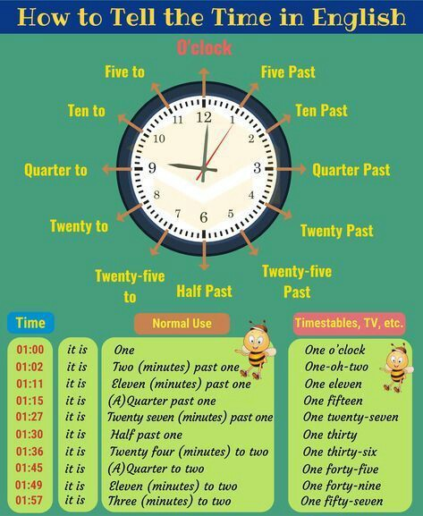
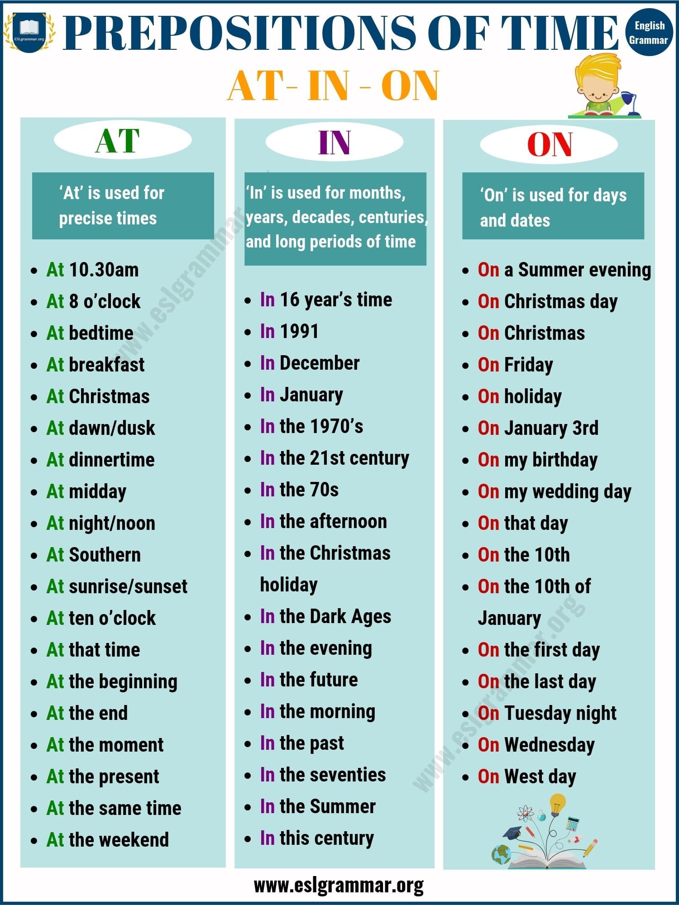
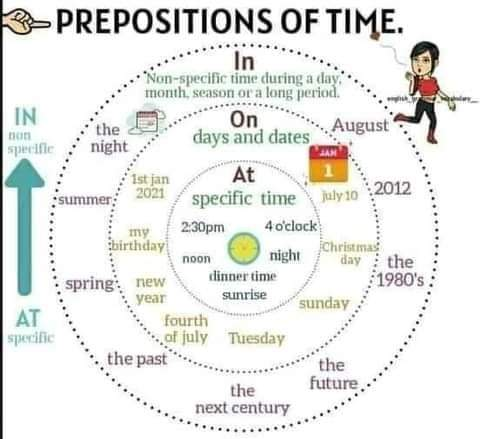

## Numbers

    * Cardinals. This numbers is used to calculations.
     
      The numbers 1 to 12:
         One
         Two
         Three
         Four
         Five
         Six
         Seven
         Eight
         Nine
         Ten
         Eleven
         Twelve
     
      The next numbers is between 13 and 19. This is write to adding end "teen"
      with a little change in any previous numbers:
         Thirteen
         Fourteen
         Fifteen
         Sixteen
         Seventeen
         Eighteen
         Nineteen
      
      The numbers 20, 30, 40, 50, 60, 70, 80 and 90 writing like previuos numbers
      but swith end by "ty":
         Twenty, thirty, forty, fifty, sixty, seventy, eighty and ninety
     
      If we have a number between 21 and 99 and second digit is not 0 then
      writing it as number ten following by "-" and number units, for example:
      26 = twenty-six

      Hundred, thousand and million:

      100        One hundred
      1,000      One thousand
      1,000,000  Million
      Sólo millones puede ir en plural

      Middle numbers
      101 one hundred one
      125 one hundred twenty-five
      555 five hundred fifty-five
      963 nine hundred sixty-three 

      1,893   One thousand, eight hundred ninety-three
      45,672  Forty-five thousand, six hundred seventy-two
      831,427 Eigth hundred thirty-one thousand, four hundred twenty-seven

      60,000,000 Sixty million
      1,590,572 One million, five hundred ninety thousand, five hundred seventy-two

    * Ordinals. This numbers is used to in lists or stabilish an order
      Se forman añadiendo la terminación -th al cardinal, excepto si es 1, 2 o 3,
      caso en el que se añade -st, -nd y -rd respectivamente.

      first – 1st
      one hundred and twenty-eighth, 128th
      thirty-second – 32nd
      ninety-third – 93rd

    * Fracciones
      Las fracciones se leen de la siguiente manera: el numerador se lee como el 
      número cardinal y el denominador se lee como el ordinal +"s" al final, 
      haciéndolo plural. Por ejemplo:

      ¼ – one fourths

      ⅔ – two thirds

      ⅗ – three fifths

      Las excepciones a esta regla son probablemente las fracciones más usadas:

      ½ – one half (en plural, halves)

      ¼ – one quarter

    * Decimales
      Los decimales se leen diciendo point entre el número entero y los que siguen
      al punto. Además ten en cuenta que se enumeran uno por uno:

      1.25 – one point two five (en español diríamos uno punto veinticinco)
      6.766 – six point seven six six
      3.5649 – three point five six four nine

    * Porcentajes
      Tan solo hay que añadir percent después del número

    25% – twenty five percent
    3.65% – three point six five percent
    100% – hundred percent

## Days

    Lunes:     Monday
    Martes:    Tuesday
    Miércoles: Wednsday    
    Jueves:    Thursday
    Viernes:   Friday
    Sábado:    Saturday
    Domingo:   Sunday

## Months
    Enero:      January
    Febrero:    Febrary
    Marzo:      March
    Abril:      April
    Mayo:       May
    Junio:      June
    Julio:      July
    Agosto:     August
    Septiembre: September
    Octubre:    October
    Noviembre:  November
    Diciembre:  December

    Es importante no olvidar la mayúscula en los meses

## Seasons

    Invierno:  Winter
    Primavera: Spring
    Verano:    Summer
    Otoño:     Autumn/Fall

## Dates
    Formato de fechas:
    Day + Month + Ordinal number + , + Year
    Monday April 26th, 2021

## Hours

## Prepositions of time:
    At: Specific time, Se usa para las horas precisas. Se usa para hablar de la 
        hora o de algo que pasa a una hora específica
        At 10:00
        At Lunch

        También se usa para hablar de un periodo de tiempo en el que se celebra
        una fiesta, aunque on se usa para hablar de la fecha en sí. 
        At Christmas, people often do good deeds.
        Durante la Navidad, la gente suele hacer buenas obras.
        You have to wait to open your presents on Christmas. You can't open them today.
        Tienes que esperar hasta Navidad para abrir los regalos. No los puedes abrir hoy.

    In: Se emplea para los meses, los años, los períodos de tiempo largos, estaciones
        del año y siglos
        In January
        In 2021
        In the XXI Century
        In Winter
        In Independence Day

        También se usa antes de hablar de medidas de tiempo expresadas con números. 
        in five minutes
        in an hour

    On: Es usado para los días de la semana, las fechas, celebraciones(por ejemplo 
        días festivos)
        On Monday
        On Monday April 26th, 2021
        On Children's Day 

        También se usa en las siguientes frases temporales.
        on the weekend
        on vacation
        on break
        on the same day

    Observación:
    in the morning, in the afternoon, in the evening por la mañana, por la tarde y por la noche
    at night por la noche (en la noche)

Another way of seeing it:

## Homework

    * Escribir con letra los números:

        1. 865,852,895: Eight hundred sixty-five millions, eight hundred fifty-two thousand, eight hundred ninety-five
        2. 325,546:     Three hundred twenty-five thousand, five hundred forty-six
        3. 564,622,525: Five hundred sixty-four millions, six hundred twenty-two thousand, five hundred twenty-five
        4. 120,003,045: One hundred twenty millions, three thousand, forty-five
        5. 464,000,001: Four hundred sixty-four millions, one

    * Contestar el ejercicio de la imagen:

   

