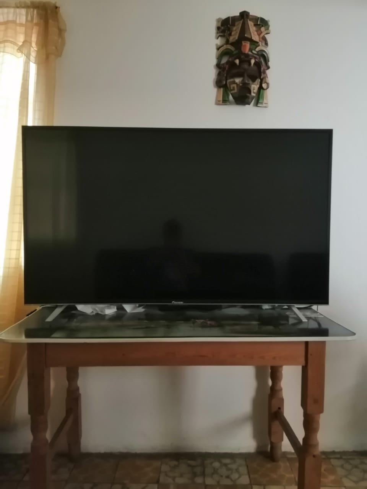

## Preposiciones de lugar

Se debe considerar:\
    Ove = About\
    In front of -> Hace referencia a que se está en fila
    Beside/By   -> Al lado (cuando se tocan)\
    Out         -> Afuera\
    Nex to      -> En seguida de pero no se tocan\
    Below       -> De bajo de pero tocando
    
## Preposiciones de movimiento

Se debe considerar:\
    Against       -> Contra de ... (es como opposite) pero en movimiento. También se ocupa cuando se choca\
    Toward        -> Hacia ...Se usa cuando no hay una ruta fija a seguir(se utliza towards)\
    Close to/Near -> Cerca de ...\
    Far           -> Lejos\
    Through       -> A través de ...\
    From          -> Origen de un punto a otro

## Direcciones(directions)

**Vocabulario:**
| Palabra                       |  Significado                                    |
| --------------------------    |  ---------------------------------------------- |
| Barrier                       |  Pluma de paso                                  |
| Level crossing                |  Para pasos de tren(luces, señalamientos, etc)  |
| Underpass                     |  Paso a desnivel                                |
| Overpass/Flyover              |  Paso elevado / paso elevado                    |
| Pedestrian crossing           |  Cruce peatonal                                 |
| Turning                       |  Dar vuelta                                     |
| Main road                     |  Calle principal como Reforma                   |
| Crossroad                     |  Cruce de caminos                               |
| Lane                          |  Carril                                         |
| Fork in the road              |  Bifurcación en el camino                       |
| Sidewalk                      |  Banqueta                                       |
| Street light/Traffic light    |  Semáforo / semáforo                            |
| Sign                          |  Señalamiento                                   |
| Pole                          |  Poste                                          |
| Parking lot                   |  Estacionamiento                                |
| Roadmark/Road marking         |  Línea que divide calle(Señalización vial)      |
| Pedestrian bridge             |  Puente peatonal                                |
| Median                        |  Camellón                                       |
| Taxi rank                     |  Sitio de taxis                                 |
| Stationer's shop              |  Tienda de papelería                            |
| Grocery store                 |  Tienda                                         |
| Mart/Market                   |  Mercado pequeño / Mercado grande como Walmart  |
| Green groceries               |  Verdulería                                     |
| Hair dresser                  |  Estética                                       |
| Deparment store               |  Tienda departamental                           |
| Jewerly                       |  Joyería                                        |
| Butcher's shop                |  Carnicería                                     |

## Homework

* Mencionar el lugar doden se encuantan los siguientes objetos:
    1. Cushion
    
    
    
        The cushion is on sofa
    
    2. Pillow
    
    
    
        The pillow is on the bed and is behind the cushions
    
    3. Salt
    
    
    
        The salt in on the table and It is near napkin holder 
    
    4. Milk
    
    
    
        The milk in on the table and It is near napkin holder and salt
    
    5. Glass
    
    
    
        The glass on the desktop, near the wallet and in front of stereo
    
    6. TV
    
    
    
        The TV is on the table and under the mask and near the window
    
    7. Computer
    
    
    
        The computer is on the desktop and under monitor base and behind keyboard and near the mouse
    
    8. Wallet
    
    
    
        The wallet is on desktop and netx to cellphone and in front of stereo
    
    9. Window
    
    
    
        The window is near sofa and behind the blind
    
    10. Book 
    
    
    
        The Calculus book is on bookcase and among another books and near Hulk toy

* Dar las indicaciones cómo llegar a los siguientes lugares cercanos a casa:
    1. Hair dresser
    
    
    
       On the low level where I live there is an hair dresser
    
    2. Oxxo
    
    
    
       Go to the Gustavo Baz Avenue, across it and go straight on, across 5 de mayo street and go straight and
       turn right in the corner, It is here Oxxo

    3. Grocery Store
    
    
    
       Go to the Gustavo Baz Avenue, in the corner turn right, go past religious goods store and 
       grocery store is here 
    
    4. Fuel Station
    
    
    
      Across Isabel la Católica street and go to the Gustavo Baz Avenue, in the corner turn left and go on 
      Gustavo Baz, go past and acroos 2 streets, across Gustavo Baz Avenue and before go fork in the road
      here fuel station 
    
    5. Supermarket
    
    
    
      Go straight on Isabel la católica street opposite Gustavo Baz, in the corner turn left
      go on straight to Pervenir Casa de Empeños and opposite is Aurrera
    
    6. Movie Teather
    
    
    
      Across Isabel la Católica street and go to the Gustavo Baz Avenue, in the corner turn left
      and go on Gustavo Baz, go past and acroos 2 streets, across Gustavo Baz Avenue and go past fuel
      station, go fork in the road, turn right and newly go stright on Periférico, go past Primero de
      mayo Avenue and Calzada San Esteban, go Crossroad, turn left, go past Plaza Torea, go straight
      in the corner turn left, past Pericentro, across Periférico and here Cinepolis
    
