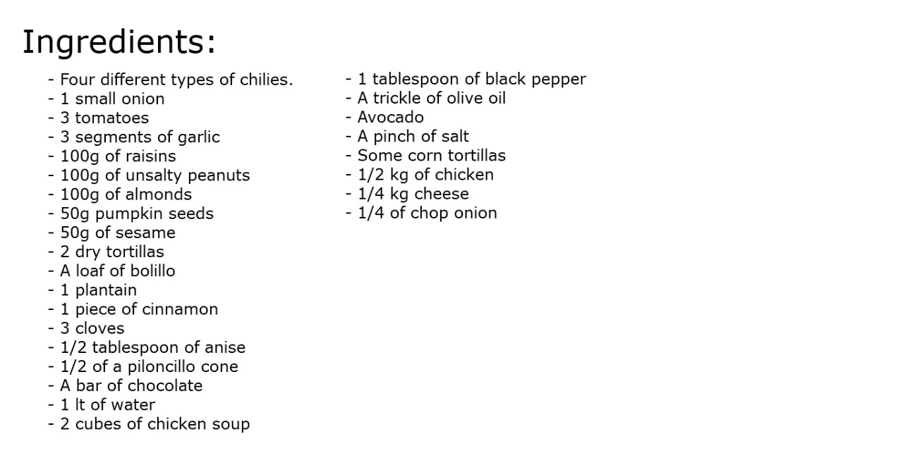
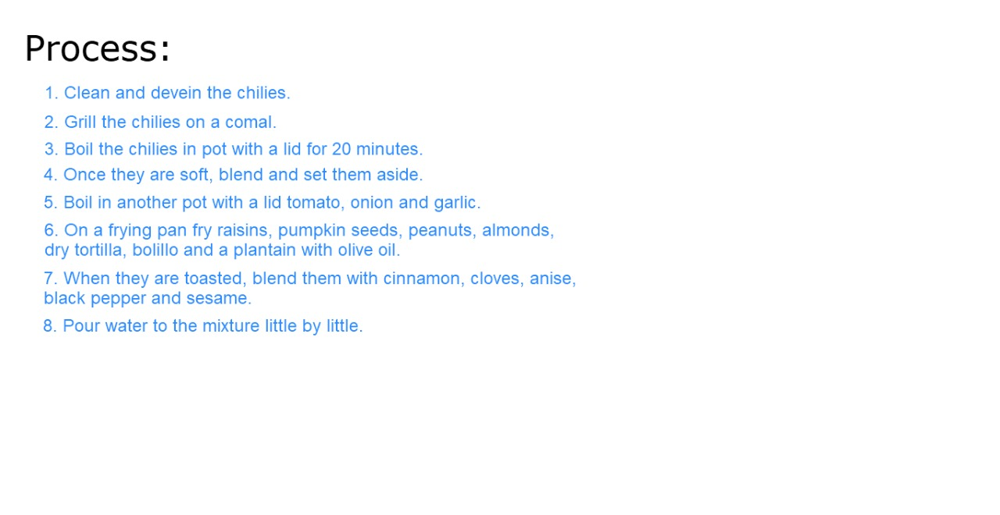

## Homework
Escribir los pasos para una receta de un platillo

**Enmoladas (Enchiladas de mole)**

9. On casserole (preferably earthenware) add vegetable oil, a bar chocolate,
   piloncillo, and the cubes of chicken soup
10. Move constantly until they fall apart.
11. Once the consistency is liquid, add all previous and the chilli sauce, using a strainer.
12. Mix very well and constantly.
13. Season one more time if is necessary.
14. Preferably use a wooden scoop to move it for a few minutes until it comes to the first boil over low heat
15. Make a more liquid mole with water
16. On frying pan fry tortillas slightly to make flautas with chicken
17. Serve on a plate the flautas and bathe with mole, add toasted sesame, onion and opcionally with
    avocado, cheese, lettuce or cream
