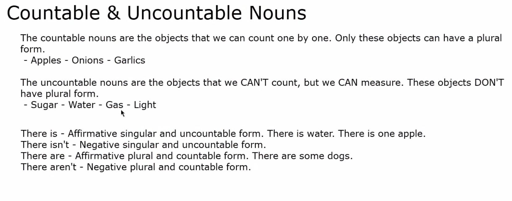

Los sustantivos contables son aquellos que se pueden contar y tienen plural.
An apple, two apples ...

Los sustantivos no contables, o incontables, son aquellos que no se pueden contar
y, por lo tanto, no tienen plural. En este grupo incluimos generalmente todas las 
sustancias, materias y cualidades abstractas.
Milk, sugar, money, wood, gold, happiness, poverty

 
Sin embargo, algunos sustantivos pueden ser contables o incontables dependiendo
de la función que desempeñan.

She bought two cakes (contable).
Ella compró dos tartas (indica las piezas).

You're eating some cake (incontable).
Estás comiendo tarta (indica la sustancia).

I'm frying an egg (contable).
Estoy friendo un huevo.

There's some egg on your t-shirt (incontable)
Hay huevo en tu camiseta (sustancia).
    

Hay algunos sustantivos que tienen dos significados uno contable (admite forma 
plural) y otro incontable (no admite forma plural):

Contable 	  Iron(s) 	    Plancha(s)
Incontable 	  Iron 	        Hierro
Contable 	  Glass(es) 	Vaso(s)
Incontable 	  Glass 	    Cristal
Contable 	  Wood(s) 	    Bosque(s)
Incontable 	  Wood 	        Madera
Contable 	  Ice(s) 	    Helado(s)
Incontable 	  Ice 	        Hielo

## Homework

1. In the kitchen there is a table 
2. In the kitchen there is a microwave
3. In the kitchen there is not a computer
4. In the kitchen there is not a tv
5. In the kitchen there are many glasses
6. In the kitchen there are kitchen utensils
7. In the kitchen there are not 
8. In the kitchen there are ...

bedroom
living room
Park 

